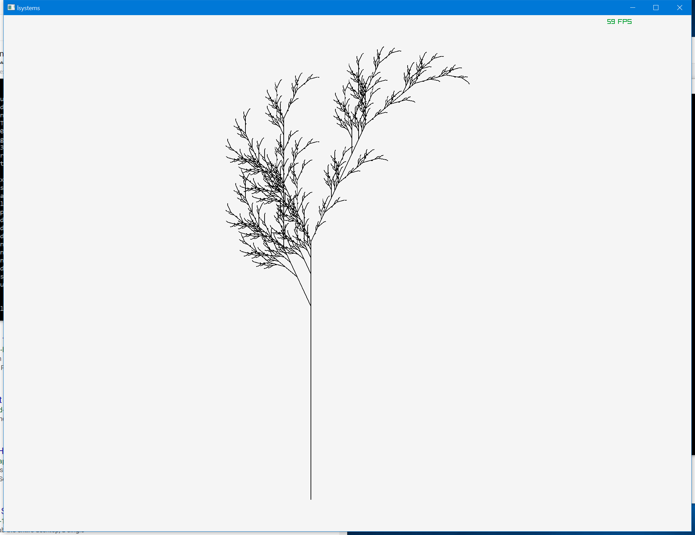
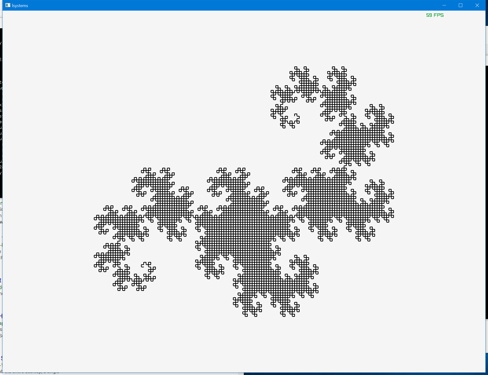
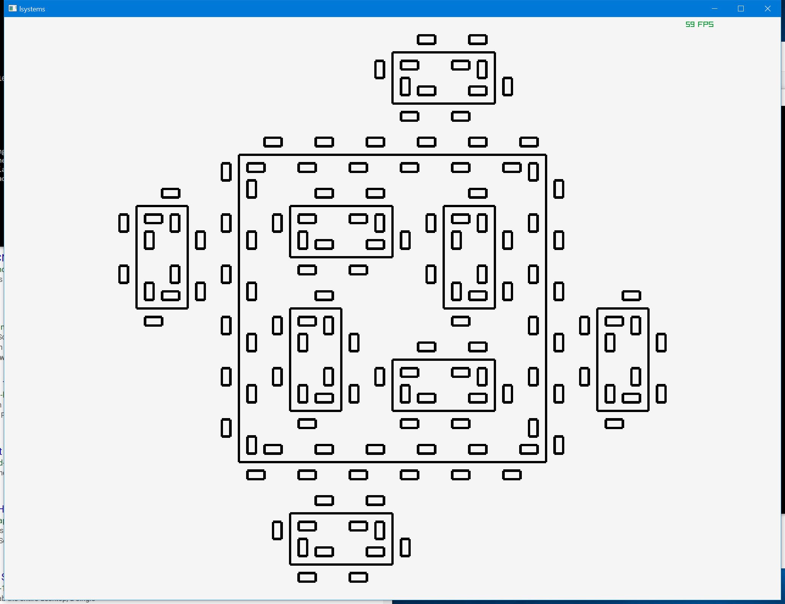

# lsystems

A simple lsystem evaluator and renderer (using a stateful 2d turtle graphics interpretation).

I did some similar stuff in clojure awhile ago [here](https://github.com/saolsen/goup-labs/blob/master/src/goup_labs/lsystems.clj)
I started rewriting it in c and realised you can imagine the nth interpretation of an lsystem as a tree where each node is part of the production rule for a node in the level above. You can therefor just do a depth first walk on the tree to evaluate the nth iteration in order without having to reify any intermediate levels. Means we need a whole lot less memory and can generate these very fast.
I suppose this is what would happen in a lazy language too if you just map the productions over the input sequence n times and iterated through it. In c you have to do it manually but it's just as cool.

